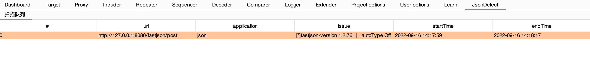

# JsonDetect
[FastjsonScan](https://github.com/a1phaboy/FastjsonScan) 移植burp插件  
支持被动扫描json，根据不同json库的特性识别出相应的json依赖库  
如果请求包body中含有json会高亮  
  
  
插件会进行被动扫描  
  
  
结果会输出至JsonDetect面板  
  

## 用法

**目前只适配burp pro版本！！！**  
**目前只适配burp pro版本！！！**  
**目前只适配burp pro版本！！！**  
  
将config文件夹以及里面的配置文件放在插件同一个根目录下即可  
config.yml文件支持自定义黑白名单以及请求包规则  
